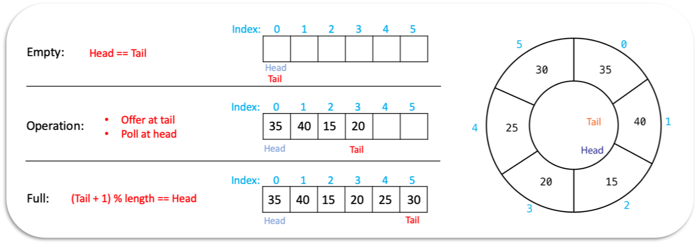

+++

## What is Circular Array?

- Circular Array is that we can connect the start and end of the array, so that it is a cycle.
- Only used in **bounded data structure**. like **bounded stack, queue, deque**
- Usually use **eager computation**



---

## Implement a Bounded Queue

- APIs:
  - boolean offer(Integer)
  - Integer   poll()
  - Integer peek()
  - int  size()
  - boolean  isEmpty()
  - boolean isFull()

- ```java
  public class BoundedQueue {
    int head;
    int tail;
    int size;
    Integer[] array;
    public BoundedQueue(int cap) {
      array = new Integer[cap];
      head = tail = 0;
      size = 0;
    }
    
    public boolean offer(Integer value) {
      if (size == array.length) {
        return false;
      }
      array[tail] = value;
      //or (tail + 1) % array.length
      tail = tail + 1 == array.length ? 0 : tail + 1;
      size++;
      return true;
    }
    
    public Integer peek() {
      if (size == 0) {
        return null;
      }
      return array[head];
    }
    
    public Integer poll() {
      if (size == 0) {
        return null;
      }
      Integer result = array[head];
      // or (head + 1) % array.length
      head = head + 1 == array.length ? 0 : head + 1;
      size--;
      return result;
    }
    
    public int size() {
      return size;
    }
    
    public boolean isEmpty() {
      return size == 0;
    }
    
    public boolean isFull() {
      return size == array.length;
    }
  }
  ```

## Implement a Bounded Stack

- APIs:

  - boolean offerFirst(Integer)
  - Integer peek()
  - Integer pollFirst()
  - int size()
  - boolean  isEmpty()
  - boolean isFull()

- ```java
  public class BoundedStack {
    int head;
    Integer[] array;
    int size;
    public BoundedStack(int cap) {
      array = new Integer[cap];
      head = 0;
      size = 0;
    }
    
    public boolean offer(Integer value) {
      if (size == array.length) {
        return false;
      }
      array[head] = value;
      head++;
      size++;
      return true;
    }
    
    public Integer peek() {
      if (size == 0) {
        return null;
      }
      return array[head];
    }
    
    public Integer pollFirst() {
      if (size == 0) {
        return null;
      }
      Integer result = array[head];
      head--;
      size--;
      return result;
    }
    
    public int size() {
      return size;
    }
    
    public boolean isEmpty() {
      return size == 0;
    }
    
    public boolean isFull() {
      return size == array.length;
    }
  }
  ```

end.